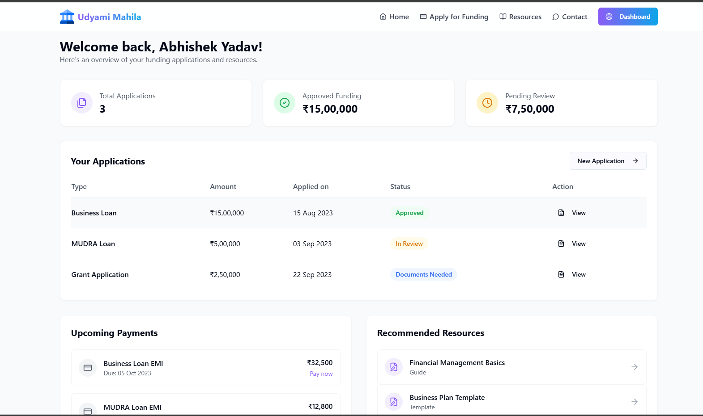
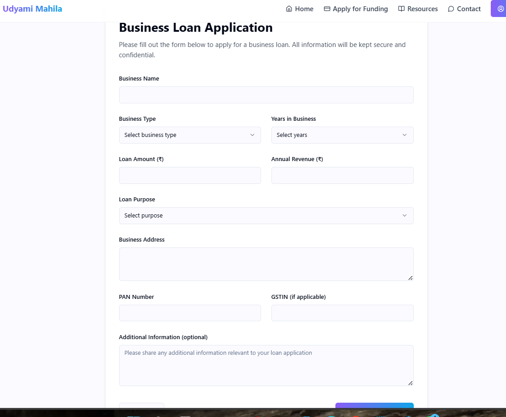

# Women-Led MSME Growth Platform

This project is designed to help women-led MSMEs (Micro, Small, and Medium Enterprises) overcome market access barriers by leveraging technology. It improves supply chain connections, increases digital visibility, and simplifies procurement system participation.

## 🚀 Features

- **Supply Chain Integration** – Connects businesses with larger supply chains.
- **Digital Visibility** – Enhances online presence for better market reach.
- **Procurement System Access** – Simplifies participation in procurement opportunities.
- **E-Commerce Enablement** – Helps businesses thrive in digital commerce.
- **User-Friendly Dashboard** – Easy-to-use interface for managing business growth.

## 🛠️ Tech Stack

- **Frontend:** React (Vite), Tailwind CSS
- **Backend:** Golang
- **Database:** Firebase (Firestore & Storage)
- **Hosting:** Firebase Hosting
- **Authentication:** Firebase Auth

## 📦 Installation

1. **Clone the repository:**
   ```bash
   git clone https://github.com/Abhi-2516/Udyami-Mahila
   cd Udyami-Mahila
   ```
2. **Install dependencies:**
   ```bash
   npm install
   ```
3. **Start the development server:**
   ```bash
   npm run dev
   ```
4. **Backend Setup (Golang)**
   - Ensure Go is installed.
   - Navigate to the backend directory and run:
     ```bash
     go run main.go
     ```

## 🔧 Configuration

- Create a `.env` file and add your Firebase configuration:
  ```env
  VITE_FIREBASE_API_KEY=your_api_key
  VITE_FIREBASE_AUTH_DOMAIN=your_auth_domain
  VITE_FIREBASE_PROJECT_ID=your_project_id
  VITE_FIREBASE_STORAGE_BUCKET=your_storage_bucket
  VITE_FIREBASE_MESSAGING_SENDER_ID=your_messaging_sender_id
  VITE_FIREBASE_APP_ID=your_app_id
  ```

## 📸 Screenshots

##  Landing Page

### Dashboard

### Funding Form


## 📬 Contact

- **Abhishek** - [2516abhi43@gmail.com](mailto:2516abhi43@gmail.com)
- **Utkarsh** - [utkarsh.cloudops@gmail.com](mailto:utkarsh.cloudops@gmail.com)

## 🤝 Contributing

1. Fork the repository.
2. Create a new branch (`feature-name`).
3. Commit your changes.
4. Push to your fork and submit a Pull Request.

## 📜 License

This project is licensed under the MIT License.
